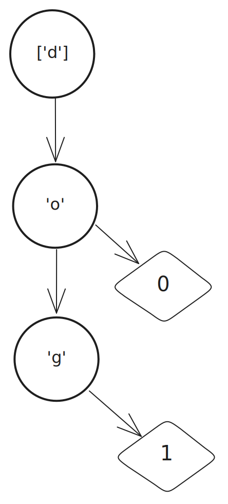

--- 
title: Efficient key bindings with Tries
date: 11-17-2024
tags: OCaml, Design, Optimization
category: Programming
---

I love working with trees. There's something very satisfying about recursive 
tree traversals - the way they naturally break down complex problems into simple
solutions. I've found this to be true in almost every language I've used 
but MLs like Haskell and OCaml lend themselves to this 
particularly well.

So when I found myself building an app with Vim-inspired key bindings in OCaml, I 
was excited to realize that a specific type of tree, call a trie (pronounced 
"try") can be used to handle key bindings. 

Let me show you how it works!

## What are we building?

Let's imagine we're writing an app where you can move around with 'hjkl' keys, and use 'q' to quit. 
First, we need some basic types to represent our app's state:

```ocaml
(* Just the basics - whether we should quit and where our cursor is *)
module App = struct
  type t =
    { should_quit : bool
    ; cursor_pos : int * int
    }
end

(* Things we can do in our app *)
module Action = struct
  type t =
    | Move of int * int (* how far to move (lines, columns) *)
    | Quit

  (* Apply an action to get a new app state *)
  let eval app = function
    | Move (dline, dcolumn) ->
      let line, column = app.cursor_pos in
      { app with cursor_pos = line + dline, column + dcolumn }
    | Quit -> { app with should_quit = true }
  ;;
end

type key_bind =
  { keys : Key.t list
  ; action : Action.t
  }

let default_keybinds =
  [ { keys = [ Key.Char 'q' ]; action = Quit }
  ; { keys = [ Key.Char 'h' ]; action = Move (0, -1) }
  ; { keys = [ Key.Char 'j' ]; action = Move (1, 0) }
  ; { keys = [ Key.Char 'k' ]; action = Move (-1, 0) }
  ; { keys = [ Key.Char 'l' ]; action = Move (0, 1) } 
  ]
;;
```

## The tricky part

Now, how do we actually match key-presses to actions? The naive way would be to:

- Push keys onto a linked list as they come in
- Check if that list matches any of our bindings
- If one matches, do the action and clear the list
- Otherwise continue, clearing the list if it gets too big

This would work! But it's not great - every time we get a new key, we have to 
check all the keys we've gotten against *every* key in *every* binding. If 
we've got a lot of key bindings, that's going to get slow.

## Enter the Trie



This is where tries come in! Think of a trie as a tree where each path from root
to leaf spells out a sequence - in our app's case, a sequence of keys that maps to an
action. When we insert the mappings 'do' → 0 and 'dog' → 1, we get the structure
shown above. 

Notice how both sequences share the path 'd' → 'o' before diverging.
This is the key insight behind tries: common prefixes are stored just once, and
we can walk down the tree one element at a time until we either find a value
(meaning we've matched a complete sequence) or hit a dead end.

Here's how we represent our trie in OCaml types:

```ocaml
module Key_trie = struct
  type t = Root of branch
  and branch = (Key.t, node) Hashtbl.t
  and node =
    | Leaf of Action.t    (* We found an action! *)
    | Branch of branch    (* More keys to go... *)
end
```
One notable difference in how we've structured our trie nodes: in a traditional 
trie, nodes can have both children and a value because any string that we use to
query the trie has a known length - when we've reached the end of the string we
know that's where our value should be. This generally includes situations with
char streams as well, in those situations its what we have that
matters, not what we may get. If you're using a trie for something like a search
engine, you want to show suggestions based on what's been typed *so far*,
and that has a known length!

But in our case, our nodes either have children *or* a value, never both. This 
is because we're dealing with a stream of keystrokes, we can't know how many are
coming. So we need the trie structure itself to tell us whether we've gotten a 
complete sequence.

One other detail: the `Root` constructor wrapping our branch type (the `type t = 
Root of branch` bit). Since a branch and the root are technically the same thing 
under the hood, we needed a way to tell them apart in our type system. This 
prevents us from accidentally passing the entire trie somewhere that expected 
a sub-tree. This is called the newtype pattern and, while out of the scope of
this article I encourage you to look it up if you're new to typed functional
programming.

Moving forward, loading up our key-binds looks like this:

```ocaml
module Key_trie = struct
  (* previous code ... *)

  let load : key_bind -> t -> t =
    fun { keys; action } (Root self) ->
    let rec go branch = function
      | [ key ] ->
        (* Last key - this is where our action goes *)
        Hashtbl.replace branch key (Leaf action);
        branch
      | key :: more_keys ->
        (match Hashtbl.find_opt branch key with
         | Some (Leaf _) ->
           (* Someone already has a shorter binding - don't override it *)
           branch
         | Some (Branch children) -> go children more_keys
         | None ->
           (* New branch! *)
           let children = Hashtbl.create num_keys in
           Hashtbl.add branch key (Branch children);
           go children more_keys)
      | [] -> 
        (* This can't happen because we exit the loop when we encounter the last
           key in the list *)
        failwith "Unreachable!"
    in
    Root (go self keys)
  ;;
end
```

Now we can define our trie iterator type:

```ocaml
module Iter = struct
  type iter = Iter of Key_trie.branch
  type search_result =
    | Got of Action.t
    | Next of iter
    | Nothing

  let create (Root root) = Iter root

  let next (Iter self) key =
    match Hashtbl.find_opt self key with
    | Some (Leaf action) -> Got action
    | Some (Branch next) -> Next (Iter next)
    | None -> Nothing
end
```

Again, we use the newtype pattern for our `iter` type to get a bit more
type safety, but maybe more interestingly we also define a type just for the
result of the `next` function. While not required, this is a strategy I find
myself using increasingly often. 

Instead of some combination of option, either, or result, which would 
effectively model our state but would lose the semantic meaning and be a bit 
harder to understand, we define something which fills both of those needs. It's 
exactly what we need, each variant communicates its own meaning, and its scope 
is small enough that missing out on the standard library's modules for those 
types doesn't really matter.

Now that we have our iterator and associated functions we can write out our
keystroke handler function. 

```ocaml
let handle_keystroke : App.t -> Key_trie.t -> unit =
  fun app_state keybinds ->
  let rec go iter =
    let key = poll_keystroke () in
    match Iter.next iter key with
    | Got action ->
      App.eval action app;
      (* Start over *)
      go (Iter.create keybinds) 
    | Next next_step -> 
      (* Continue *)
      go next_step 
    | Nothing -> 
      (* Start over *)
      go (Iter.create keybinds)
  in
  go (Iter.create keybinds)
;;
```

Super simple, we get a key then try to advance. If we get an action we evaluate
it and start the iterator back from the root, if not we continue. If we hit a
dead end we also restart from the root. 

This method:

1. Is much faster than the naive approach.
2. Makes the control flow clear
3. Makes it easy to add user-defined bindings
4. Works great with blocking and async IO

Ultimately, there are a few other things you'd want to add to get parity with
Vim. Keeping track of pressed modifiers, handle `esc` separately so that it can
restart the iterator. But this covers a surprising amount, and is efficient and
elegant! Now go write a text editor! 
